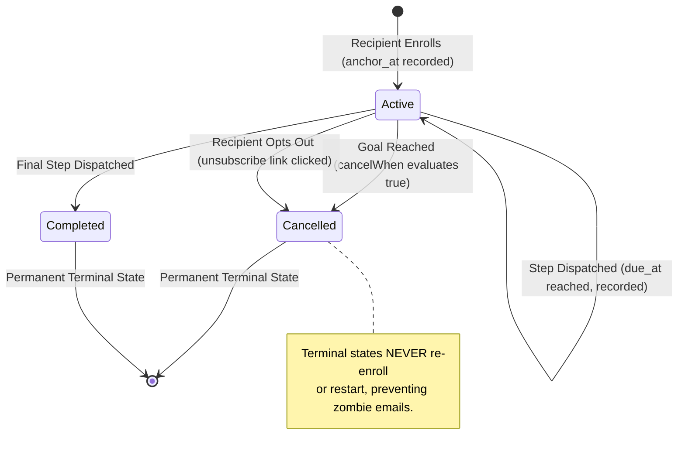
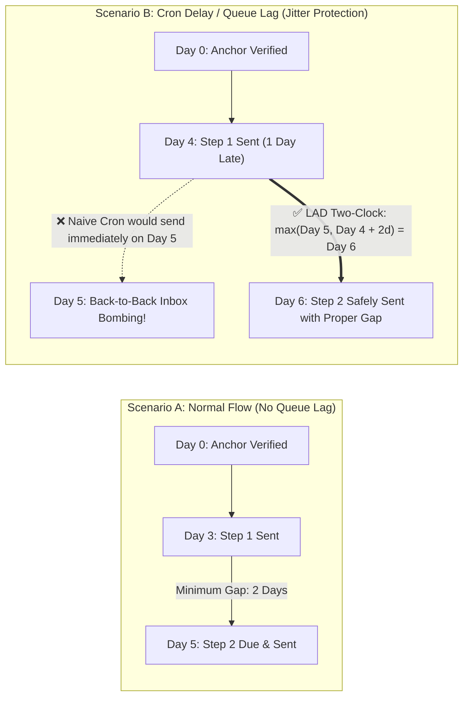
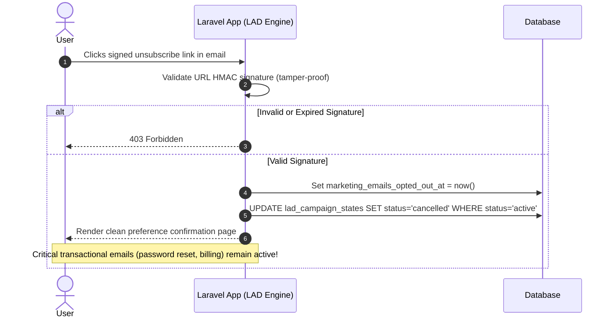

# Laravel Atlas Drip (`lad`)

[](https://packagist.org/packages/ismail-rt/laravel-atlas-drip)
[](https://packagist.org/packages/ismail-rt/laravel-atlas-drip)
[](https://github.com/ismail-rt/laravel-atlas-drip/actions)
[](LICENSE.md)
[](https://php.net)
[](https://laravel.com)

**A headless, state-driven lifecycle & drip campaign engine for Laravel with zero double-sends, automatic cooldowns, and jitter-proof timing.**

Built for Laravel SaaS developers, indie hackers, and engineering teams needing robust, code-defined onboarding and retention drip campaigns without paying $200–$1,000/mo for external SaaS marketing tools (Customer.io, Braze, Iterable).

---

## Table of Contents

- [The Problem: Why Naive Drip Logic Fails](#the-problem-why-naive-drip-logic-fails)
- [How LAD Solves It (Architecture & Flow)](#how-lad-solves-it-architecture--flow)
- [Campaign State Machine](#campaign-state-machine)
- [The Two-Clock Formula](#the-two-clock-formula)
- [Signed Unsubscribe Flow](#signed-unsubscribe-flow)
- [Installation](#installation)
- [Configuration](#configuration)
- [Defining Campaigns](#defining-campaigns)
- [Artisan Commands](#artisan-commands)
- [Events & Observability](#events--observability)
- [Running Tests](#running-tests)
- [License](#license)

---

## The Problem: Why Naive Drip Logic Fails

Almost every developer writing scheduled emails starts with this naive approach:

```php
// THE NAIVE PATTERN (DANGEROUS IN PRODUCTION)
User::where('email_verified_at', '<=', now()->subDays(3))->get()->each(function ($user) {
    Mail::to($user)->send(new OnboardingMail());
});
```

In production, this pattern causes **6 critical failures**:

1. **The "Catch-Up Blast" (First Deploy Disaster):** Deploying this logic to an existing database with 50,000 users causes all 50,000 users to receive Day 3, Day 5, and Day 7 emails simultaneously on the first cron run.
2. **The "Cron Lag Compression" Bug:** If a queue backs up or cron is paused for 4 days, both Day 3 and Day 5 milestones become overdue. On the next run, the user receives both emails back-to-back.
3. **Double-Sends via Race Conditions:** In multi-worker setups, two workers pick up the same batch and email the same user twice within milliseconds without atomic database-level deduplication.
4. **Cross-Campaign Inbox Bombing:** A user triggers Onboarding, Win-Back, and Feature Announcement campaigns on the same day. Without a global cooldown, they receive 3 marketing emails in one afternoon.
5. **The Zombie Campaign (Ignored Goal Completion):** A user signs up, verifies email, and immediately pays for an annual plan. Three days later, naive cron sends: *"Hey! Why haven't you explored our app yet?"*
6. **Entangled Unsubscribes:** Users clicking "unsubscribe" on a marketing drip get opted out of critical transactional emails (password resets, invoices, security alerts) because there is no separate lifecycle opt-out ledger.

---

## How LAD Solves It (Architecture & Flow)

LAD evaluates recipients through a strict **State Machine + Atomic Deduplication + Two-Clock Pipeline**:

```mermaid
flowchart TD
    Start(["⏰ Cron / Scheduler<br/><code>php artisan lad:send</code>"]) --> Chunk["Fetch Recipients in Chunks<br/><code>chunkById(100)</code>"]

    subgraph RecipientPipeline["Recipient Evaluation Pipeline"]
        direction TB
        OptCheck{"Opted Out?<br/><code>marketing_emails_opted_out_at</code>"}
        OptCheck -->|Yes| SkipOptOut["🚫 Skip Recipient<br/><i>Cancel active states</i>"]
        OptCheck -->|No| CooldownCheck{"In 48h Cooldown?<br/><i>Any lifecycle email sent recently?</i>"}

        CooldownCheck -->|Yes| SkipCooldown["🛑 Skip Recipient<br/><i>Protect inbox from multi-campaign flood</i>"]
        CooldownCheck -->|No| PriorityLoop["Iterate Campaigns by Priority<br/><code>10 (Onboarding) ➔ 20 (Win-back)</code>"]

        subgraph CampaignEval["Campaign Evaluation (Priority Order)"]
            StateCheck{"Active State<br/>Exists?"}

            StateCheck -->|No| HistCutoff{"Anchor &lt; Cutoff<br/>or Max Age Exceeded?"}
            HistCutoff -->|Yes| RejectEnroll["Skip Enrollment<br/><i>Prevents first-deploy blast</i>"]
            HistCutoff -->|No| Enroll["Create State: <b>active</b><br/><code>anchor_at = reference clock</code>"]

            StateCheck -->|Yes| GoalCheck{"Goal Reached?<br/><code>cancelWhen() == true</code>"}
            GoalCheck -->|Yes| CancelState["Mark State: <b>cancelled</b><br/><i>Terminal state (never restarts)</i>"]
            GoalCheck -->|No| NextStep["Resolve Next Step in Sequence"]

            Enroll --> NextStep
            NextStep --> TimingCheck{"Is Step Due?<br/><code>Two-Clock Formula</code>"}
            TimingCheck -->|No| NextCampaign["Wait for due date<br/><i>Check next campaign</i>"]
            TimingCheck -->|Yes| AtomicTx["⚡ <b>Atomic Dedupe Transaction</b><br/><code>INSERT INTO lad_notification_logs</code>"]

            AtomicTx --> UniqueViolation{"Unique Key<br/>Collision?"}
            UniqueViolation -->|Yes (Race Condition)| Rollback["Rollback DB Tx<br/><i>Skip silently (zero double-sends)</i>"]
            UniqueViolation -->|No| Dispatch["📨 <b>Dispatch Notification / Mailable</b>"]
            Dispatch --> UpdateState["Update State<br/><code>last_step</code>, <code>last_sent_at</code>"]
            UpdateState --> TerminalCheck{"Was Last Step?"}
            TerminalCheck -->|Yes| MarkCompleted["Mark State: <b>completed</b>"]
            TerminalCheck -->|No| SingleSendExit["🏁 <b>Single Send Limit Reached</b><br/><i>Stop evaluation for this recipient</i>"]
            MarkCompleted --> SingleSendExit
        end
    end

    Chunk --> RecipientPipeline
```

---

## Campaign State Machine

Each recipient journey is tracked as an explicit, tamper-proof state machine stored in `lad_campaign_states`:



- **`active`**: The recipient is moving through sequential steps.
- **`completed`**: All configured steps have been successfully dispatched.
- **`cancelled`**: The user reached the campaign's conversion goal (e.g. upgraded to paid plan) or opted out. Terminal states **never re-enroll or restart**.

---

## The Two-Clock Formula

When evaluating whether sequential step $N$ is due, LAD computes:

$$\text{due\_at} = \max(\text{anchor\_at} + \text{offset},\; \text{previous\_step.sent\_at} + \text{minimum\_gap})$$



*Why this matters:* If Day 3 email sends on Day 4 due to a queue outage, and Day 5 has a `minimumGapDays(2)`, Step 2 will **not** send on Day 5. It automatically waits until at least Day 6.

---

## Signed Unsubscribe Flow

LAD isolates marketing opt-outs from transactional emails (invoices, password resets, security alerts) with a built-in cryptographic HMAC flow:



---

## Installation

Install the package via Composer:

```bash
composer require ismail-rt/laravel-atlas-drip
```

Publish and run the database migrations:

```bash
php artisan vendor:publish --tag=lad-migrations
php artisan migrate
```

Optionally publish the configuration file and views:

```bash
php artisan vendor:publish --tag=lad-config
php artisan vendor:publish --tag=lad-views
```

---

## Configuration (`config/lad.php`)

```php
return [
    /*
    |--------------------------------------------------------------------------
    | Engine Enabled
    |--------------------------------------------------------------------------
    */
    'enabled' => env('LAD_ENABLED', true),

    /*
    |--------------------------------------------------------------------------
    | Global Inter-Campaign Cooldown (Hours)
    |--------------------------------------------------------------------------
    | If a recipient received ANY lifecycle email in the last X hours,
    | subsequent campaign emails are paused to prevent inbox bombing.
    */
    'global_cooldown_hours' => (int) env('LAD_COOLDOWN_HOURS', 48),

    /*
    |--------------------------------------------------------------------------
    | Historical Enrollment Cutoff
    |--------------------------------------------------------------------------
    | Optional timestamp (e.g. '2026-09-01 00:00:00'). Recipients whose anchor
    | is prior to this date are rejected from enrollment unless a prior notification
    | log proves they were already in the campaign.
    */
    'enrollment_started_at' => env('LAD_ENROLLMENT_STARTED_AT', null),

    /*
    |--------------------------------------------------------------------------
    | Default Recipient Model
    |--------------------------------------------------------------------------
    */
    'recipient_model' => env('LAD_RECIPIENT_MODEL', App\Models\User::class),

    /*
    |--------------------------------------------------------------------------
    | Database Table Names
    |--------------------------------------------------------------------------
    */
    'table_names' => [
        'states' => env('LAD_TABLE_STATES', 'lad_campaign_states'),
        'logs' => env('LAD_TABLE_LOGS', 'lad_notification_logs'),
    ],

    /*
    |--------------------------------------------------------------------------
    | Signed Unsubscribe Routing
    |--------------------------------------------------------------------------
    */
    'routes' => [
        'enabled' => true,
        'prefix' => 'lad',
        'middleware' => ['web'],
    ],
];
```

---

## Defining Campaigns

Register campaigns in your `AppServiceProvider` or a dedicated provider using the fluent builder. You can use either `Lad\Facades\Lad` or `Vendor\Lifecycle\Facades\Lifecycle`:

```php
use Lad\Facades\Lad;
use Lad\Campaign;
use Lad\Step;

// 1. Onboarding Campaign
Lad::register(
    Campaign::make('onboarding')
        ->priority(10) // Lower number = evaluated first
        // Who qualifies for this campaign?
        ->eligible(fn ($user) => $user->hasVerifiedEmail() && !$user->isAdmin())
        // What is the reference time clock?
        ->anchor(fn ($user) => $user->email_verified_at)
        // Maximum age for initial enrollment (failsafe against first-deploy explosions)
        ->maxEnrollmentAgeDays(10)
        // Goal completion: cancel when user achieves desired action
        ->cancelWhen(fn ($user) => $user->properties()->exists())
        // Sequential steps
        ->steps([
            Step::make('day3')
                ->offsetDays(3)
                ->notification(OnboardingReminderNotification::class),

            Step::make('day5')
                ->offsetDays(5)
                ->minimumGapDays(2)
                ->notification(OnboardingTipsNotification::class),

            Step::make('day7')
                ->offsetDays(7)
                ->minimumGapDays(2)
                ->notification(function ($user) {
                    return new OnboardingDiscountNotification(promoCode: 'WELCOME15');
                }),
        ])
);

// 2. Recurring Streak Campaign (e.g., Idle Win-Back)
Lad::register(
    Campaign::make('idle_winback')
        ->priority(20)
        ->eligible(fn ($user) => $user->properties()->exists())
        ->anchor(fn ($user) => $user->last_login_at)
        // Custom instance key isolates recurring streaks
        ->instanceKey(fn ($user) => $user->last_login_at?->utc()->format('Y-m-d-H-i-s'))
        ->cancelWhen(fn ($user) => $user->last_login_at?->gt(now()->subDays(7)))
        ->steps([
            Step::make('idle_reminder')
                ->offsetDays(7)
                ->notification(WeMissYouNotification::class),
        ])
);
```

### Flexible Step Offsets & Gaps

Step timings support days, hours, and minutes:

```php
Step::make('welcome_hour2')
    ->offsetHours(2)
    ->minimumGapHours(1)
    ->notification(QuickStartNotification::class);
```

---

## Artisan Commands

### 1. Dispatch Due Emails (`lad:send`)
Schedule this command in `routes/console.php` to run hourly:

```php
use Illuminate\Support\Facades\Schedule;

Schedule::command('lad:send')->hourly();
```

Command options:

```bash
# Execute standard dispatch run
php artisan lad:send

# Aliases also supported:
php artisan lifecycle:send
php artisan drip:send

# Dry run: preview dispatches without modifying DB or sending emails
php artisan lad:send --dry-run

# Filter to a specific campaign or recipient
php artisan lad:send --campaign=onboarding
php artisan lad:send --recipient=42
```

### 2. Inspect Recipient Status (`lad:status`)
Diagnose recipient eligibility, cooldown window, active campaign states, and upcoming step dates:

```bash
php artisan lad:status 42
# Alias:
php artisan lifecycle:status 42
```

Example tabular output:
```
Status for Recipient #42:
 - Global Cooldown: INACTIVE (Ready)
 - Opted Out: NO
 - Last Notification Sent At: 2026-09-04 10:00:00

+------------+---------+---------------------+-----------+-----------+---------------------+---------+
| Campaign   | Status  | Anchor At           | Last Step | Next Step | Due At              | Is Due? |
+------------+---------+---------------------+-----------+-----------+---------------------+---------+
| onboarding | active  | 2026-09-01 10:00:00 | day3      | day5      | 2026-09-06 10:00:00 | YES     |
+------------+---------+---------------------+-----------+-----------+---------------------+---------+
```

### 3. Manually Cancel Campaign (`lad:cancel`)
Manually transition campaign states to `cancelled` for a recipient:

```bash
# Cancel all active campaigns for recipient #42
php artisan lad:cancel 42

# Cancel a specific campaign
php artisan lad:cancel 42 onboarding
# Alias:
php artisan lifecycle:cancel 42
```

---

## Events & Observability

LAD dispatches standard Laravel events for metrics, analytics, or logging:

| Event | Dispatched When | Payload |
| :--- | :--- | :--- |
| `Lad\Events\CampaignEnrolled` | Recipient enters a new campaign | `$recipient`, `$campaign`, `$state` |
| `Lad\Events\StepDispatched` | Step notification is sent | `$recipient`, `$campaign`, `$step`, `$state`, `$log` |
| `Lad\Events\CampaignCompleted` | Final step is sent | `$recipient`, `$campaign`, `$state` |
| `Lad\Events\CampaignCancelled` | Goal reached or user opted out | `$recipient`, `$campaign`, `$state`, `$reason` |

Listen to events in your `EventServiceProvider` or `AppServiceProvider`:

```php
use Illuminate\Support\Facades\Event;
use Lad\Events\StepDispatched;

Event::listen(StepDispatched::class, function (StepDispatched $event) {
    Log::info("Dispatched {$event->campaign->getName()}:{$event->step->getKey()} to #{$event->recipient->id}");
});
```

---

## Running Tests

Run the complete test suite with Pest:

```bash
vendor/bin/pest
# Or via artisan:
php artisan test
```

---

## License

The MIT License (MIT). Please see [License File](LICENSE.md) for more information.
